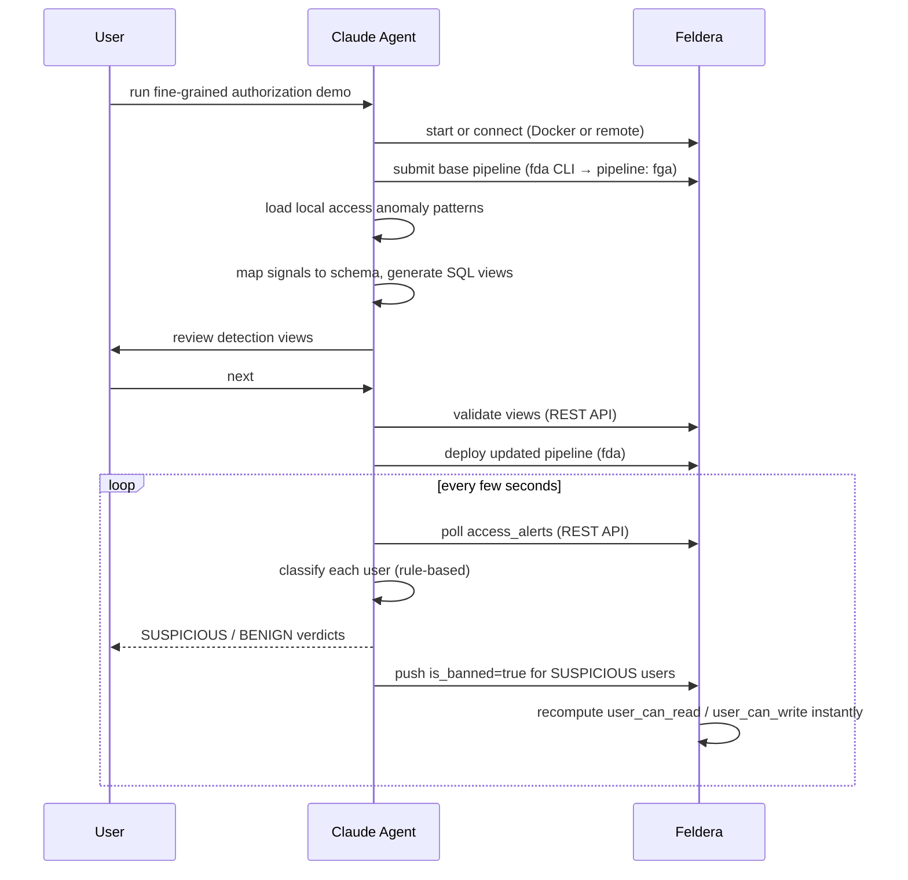

# Fine-Grained Authorization Demo

Ready-to-run demo. No arguments needed — all config is pre-filled in `fga_init.md`.

Run this slash command in Claude Code from the repository root:

```
/run_fga_demo
```

## What it does



1. Checks the `fda` CLI, starts Feldera (Docker) or connects to a remote instance, verifies the SQL compiler
2. Loads and starts the Fine-Grained Authorization pipeline automatically
3. Reads the local access anomaly pattern file, maps signals to the schema, generates SQL detection views
4. Pauses for review, then validates and deploys
5. Builds an `access_alerts` materialized UNION view across all signal views
6. Launches the live access investigator — classifies each user and blocks SUSPICIOUS ones by pushing
   `is_banned=true` via the ingress API; Feldera immediately recomputes `user_can_read` / `user_can_write`

## Pipeline

The base pipeline (`programs/fga.sql`) implements a policy engine using mutually recursive SQL:

- **Users, groups, files** — core objects with group-based editor/viewer relationships
- **`group_can_read` / `group_can_write`** — recursive views that propagate permissions through folder hierarchies
- **`user_can_read` / `user_can_write`** — materialized views that resolve per-user permissions, filtering out `is_banned` users
- **`access_log`** — 1M synthetic access events + a planted attacker (user 42) with 500 events in one 1-hour window

## Anomaly patterns

Defined in `patterns/access.md`:

| Pattern | Signal | Threshold |
|---------|--------|-----------|
| Rapid Enumeration Attack | Distinct parent folders per user / 1h | ≥ 20 (attacker reaches ~500) |
| Hot Folder Anomaly | Distinct users per folder / 6h | ≥ 40 |

## Real-time blocking

When the investigator classifies a user as SUSPICIOUS, it pushes `is_banned=true` to the `users` table
via the Feldera ingress API. Feldera recomputes `user_can_read` and `user_can_write` within milliseconds —
the user's access is revoked before the next request is processed.

## Config (`fga_init.md`)

| Key | Description |
|-----|-------------|
| `ProgramPath` | Path to the base SQL file |
| `PatternURL` | Path to the local pattern file (read directly — not a web URL) |

## Files

| File | Purpose |
|------|---------|
| `fga_init.md` | Pre-filled demo config |
| `feldera-analyze-fga.md` | Agentic step-by-step guide — read by the agent when the demo runs |
| `fga_investigator.py` | Rule-based agent — classifies users, blocks SUSPICIOUS ones |
| `patterns/access.md` | Access anomaly pattern descriptions |
| `programs/fga.sql` | Base pipeline SQL (fine-grained authorization + attacker datagen) |
| `demo_runs/` | Timestamped run artifacts (gitignored) |
