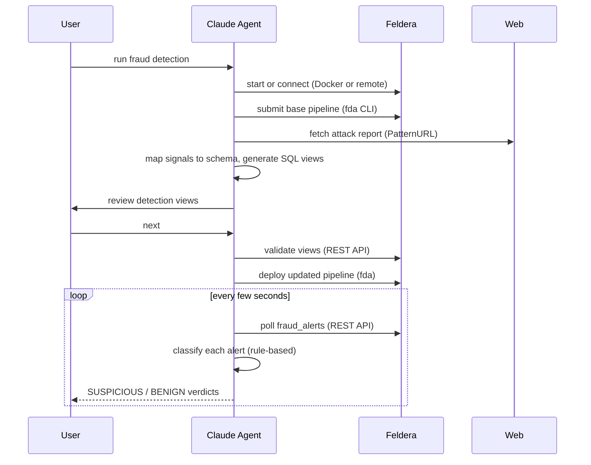

# Fraud Detection Demo

Ready-to-run demo. No arguments needed — all config is pre-filled in `fraud_init.md`.

Run this slash command in Claude Code from the repository root:

```
/run_fraud_demo
```

## What it does



1. Checks the `fda` CLI, starts Feldera (Docker) or connects to a remote instance, verifies the SQL compiler
2. Loads and starts the base fraud detection pipeline automatically
3. Loads the embedded attack pattern, maps signals to the schema, generates SQL detection views
4. Pauses for review, then validates and deploys
5. Builds a `fraud_alerts` materialized UNION view across all signal views
6. Launches the live fraud investigator — polls alerts, classifies each card with a rule-based engine

## Pipeline

The base pipeline (`programs/fraud_detection_demo.sql`) implements a feature engineering pipeline:

- **`CUSTOMER`** — 100K synthetic credit card holders with home address coordinates
- **`TRANSACTION`** — 1M transactions at 1000/s with category, amount, and shipping address
- **`TRANSACTION_WITH_DISTANCE`** — enriches each transaction with `ST_DISTANCE` between shipping and home address (in degrees; 0.5° ≈ 55 km)
- **`TRANSACTION_WITH_AGGREGATES`** — adds rolling 1-day aggregates per card: `avg_1day` (average spend) and `count_1day` (count of distant transactions)

## Config (`fraud_init.md`)

| Key | Description |
|-----|-------------|
| `ProgramPath` | Path to the base SQL file |
| `PatternURL` | URL of the attack report — fetched at runtime via Python with a browser User-Agent |

## Files

| File | Purpose |
|------|---------|
| `fraud_init.md` | Pre-filled demo config |
| `feldera-analyze-fraud.md` | Agentic step-by-step guide — read by the agent when the demo runs |
| `patterns/fraud_attack.md` | Embedded attack pattern (card skimming report) |
| `fraud_investigator.py` | Rule-based agent that classifies alerts live |
| `programs/fraud_detection_demo.sql` | Base pipeline SQL |
| `demo_runs/` | Timestamped run artifacts (gitignored) |
