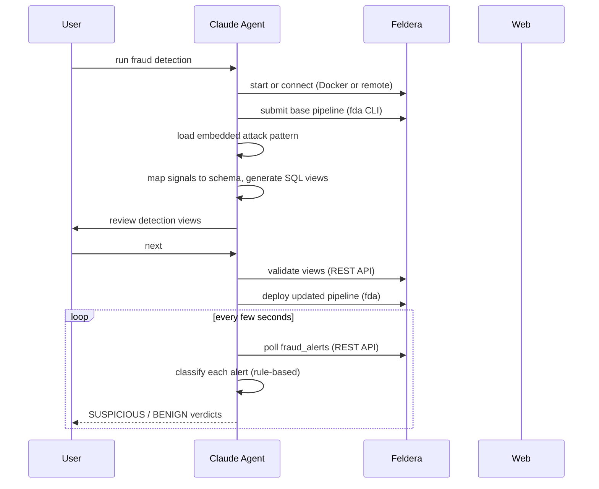

# Fraud Detection Demo

Ready-to-run demo. No arguments needed — all config is pre-filled in `fraud_init.md`.

```
run fraud detection
```

## What it does



1. Checks the `fda` CLI, starts Feldera (Docker) or connects to a remote instance, verifies the SQL compiler
2. Loads and starts the base fraud detection pipeline automatically
3. Loads the embedded attack pattern, maps signals to the schema, generates SQL detection views
4. Pauses for review, then validates and deploys
5. Builds a `fraud_alerts` materialized UNION view across all signal views
6. Launches the live fraud investigator — polls alerts, classifies each card with a rule-based engine

## Config (`fraud_init.md`)

| Key | Description |
|-----|-------------|
| `ProgramPath` | Path to the base SQL file |
| `PatternURL` | URL of the attack report — fetched at runtime via Python with a browser User-Agent |

## Files

| File | Purpose |
|------|---------|
| `fraud_init.md` | Pre-filled demo config |
| `patterns/fraud_attack.md` | Embedded attack pattern (card skimming report) |
| `fraud_investigator.py` | Rule-based agent that classifies alerts live |
| `programs/fraud_detection_demo.sql` | Base pipeline SQL |
| `demo_runs/` | Timestamped run artifacts (gitignored) |
