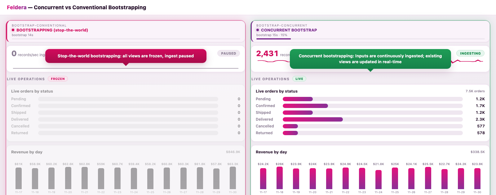

# Concurrent Bootstrapping — keep existing views live while new ones backfill

When you add or change views in a running Feldera pipeline and restart, Feldera **bootstraps**
the new/changed views: it rebuilds them from the pipeline's checkpointed state instead of
re-ingesting history. This demo shows the difference between the two bootstrap modes, side by side:

| Mode | What happens to the pipeline while the new views build |
|------|--------------------------------------------------------|
| **Conventional** (`concurrent_bootstrap=false`) | Stop-the-world. Input ingestion pauses and **every** view freezes — even views the change never touched — until bootstrapping finishes. Then everything resumes at once. |
| **Concurrent** (`concurrent_bootstrap=true`) | The pipeline keeps ingesting. **Existing views stay live** and up to date on the incoming stream while the **new views backfill in the background**, then atomically switch in. |

Two identical pipelines (`bootstrap-conventional`, `bootstrap-concurrent`) are backfilled with the
same large clickstream dataset, checkpointed, then given the same set of new analytical views. A live
datagen stream keeps flowing into both during the bootstrap. The dashboard makes the contrast obvious:
the conventional side flatlines; the concurrent side keeps ingesting and its existing views stay live.



*Mid-bootstrap: the conventional pipeline (left) is frozen — ingest at 0, every view greyed out — while
the concurrent pipeline (right) keeps ingesting (2.4K rec/s) and its existing views (orders, revenue)
update live. The new analytical views build in the background on both and switch in at the end.*

Docs: https://docs.feldera.com/pipelines/modifying#concurrent-bootstrapping

---

## What you see on the dashboard

Two BI columns side by side, each with a runtime banner, an **ingest gauge** (records/sec + sparkline),
and chart panels:

```
┌── CONVENTIONAL ────────────┬── CONCURRENT ──────────────┐
│ BOOTSTRAPPING (red)        │ CONCURRENT BOOTSTRAP (blue)│  runtime + progress bar
│ ingest 0/s 🔴 PAUSED       │ ingest 2.5k/s 🟢 INGESTING │  the freeze/live signal
│ Live operations   🔴 FROZEN│ Live operations    🟢 LIVE │
│ Live orders/status ░░░░░░  │ Live orders/status ▃▅▆▇▆▅  │  orders THIS run, fills live
│  Revenue by day   ▁▁▁▁▁▁▁  │  Revenue by day   ▃▄▅▄▃▄▅  │  histogram, last 14 days
│ New analytics   ⏳ building │ New analytics   ⏳ building │  silent until cutover, then
│  Live clicks/day, KPIs     │  Live clicks/day ▅▆▃▇█▄, KPIs│  chart + KPIs light up
└────────────────────────────┴────────────────────────────┘
```

- **Conventional**: the ingest gauge drops to 0 and every chart freezes for the whole bootstrap. The
  `Live orders by status` bars stay empty (no orders served during the freeze), then start filling only
  once the pipeline thaws.
- **Concurrent**: the ingest gauge stays up; the `Live orders by status` bars fill steadily from empty
  as orders arrive throughout the bootstrap, and `Revenue by day` keeps climbing. The `New analytics`
  panels stay `⏳ bootstrapping…` and light up only at the cutover — then `Live clicks by day` fills from
  empty like the orders panel (a realistic weekday-high/weekend-low daily shape) and the KPIs populate.

`Live orders by status` counts orders received *since this run started* (a baseline captured at restart),
so the bars grow from empty as the `orders` stream flows — the clearest signal of which pipeline is still
serving. Because both sides carry the same backfill, showing orders-this-run makes the live flow obvious
instead of hiding it under a large, slow-moving cumulative total.

---

## How it works

- All tables are declared `'materialized' = 'true'` — bootstrapping rebuilds new views from
  materialized state, so this is **required** (a non-materialized table cannot be bootstrapped from).
- No `LATENESS` anywhere — bootstrapping is incompatible with it.
- **v1** (`build_sql(size, heavy=False)`): the tables plus two cheap *existing* views over the
  `orders` table (`gold_live_orders`, `gold_order_revenue`) that the live order stream keeps fresh.
  They aggregate `orders`, which the change never touches, so a concurrent bootstrap keeps them
  fully live and ad-hoc queries return correct, updating values throughout. (A view over
  `clickstream` would instead be pulled into the bootstrap, since that table is replayed to backfill
  the new views — the "unmodified views may need bootstrapping" caveat — and would read empty until
  the cutover; that's why the live panels aggregate `orders`, not `clickstream`.)
- **v2** (`build_sql(size, heavy=True)`): v1 plus three *new* views that each scan the whole
  backfilled `clickstream` history to build their first contents — that first build is the bootstrap,
  and what takes time (`gold_user_product_engagement`, `gold_product_daily_reach`, `gold_user_stats`).
- Adding the new views is a view-only change; the tables are untouched, which is the precondition
  concurrent bootstrapping requires (it is rejected if any table is added or modified).
- The dataset is generated by Feldera's `datagen` connector (parallel bulk generators for the
  backfill + one rate-limited generator for the live stream), so the demo is self-contained — no S3.

Everything is driven through the **Feldera Python SDK** (`run.py` / `dashboard_server.py`); nothing
calls the REST API directly. The browser talks only to the local dashboard server.

---

## Prerequisites

**Concurrent bootstrapping is an enterprise feature**, so you need an enterprise Feldera instance
on `http://localhost:8080`:

- **Enterprise Docker image** — see https://docs.feldera.com; start it so the API is on `:8080`.
- **Dev build from source** (`~/projects/feldera`) — `scripts/start_enterprise.sh` links in the
  enterprise features and runs the manager on `:8080`:

  ```bash
  cd ~/projects/feldera && scripts/start_enterprise.sh    # builds + runs; leave it running
  ```

Then a Python that can import the Feldera SDK **and** `pyarrow`. The `concurrent_bootstrap` flag is
only in recent SDKs; against a dev build install the SDK *from the source checkout* so its
dependencies come with it (a bare `PYTHONPATH` misses them). Define the runner once, with
[uv](https://docs.astral.sh/uv/):

```bash
# dev SDK (editable) + pyarrow in one ephemeral env — the reliable invocation
PY="uv run --no-project --with 'pyarrow>=17' --with-editable $HOME/projects/feldera/python run.py"

# once concurrent_bootstrap ships to PyPI, a released SDK is simply:
# PY="uv run --no-project --with 'feldera>=X.Y' --with 'pyarrow>=17' run.py"
```

---

## Run it

All commands run from `concurrent-bootstrapping/`, using the `$PY` runner from Prerequisites.

```bash
# 1. Backfill both pipelines and checkpoint. One-time; the checkpoint is reused across runs.
#    --size is the backfilled clickstream events per pipeline (default 20M ~= a 25-30s bootstrap).
$PY setup

# 2. Start the side-by-side dashboard (leave it running in another terminal).
$PY serve            # http://localhost:8090

# 3. Fire the demo: add the new views and restart both pipelines. Watch the dashboard.
$PY bootstrap

# 4. Roll both pipelines back to the pre-bootstrap checkpoint to run it again.
$PY reset

# Anytime:
$PY status           # deployment / bootstrap state of both pipelines
$PY teardown         # delete both pipelines and their storage
```

Recommended flow: `setup` once → `serve` (keep open) → `bootstrap` → watch → `reset` → `bootstrap` again.

---

## Driving it manually

`$PY bootstrap` fires both pipelines at once. To drive one pipeline by hand (e.g. show
stop-the-world first, then concurrent), the recipe is: **stage the new views while the pipeline is
stopped**, then **start with the bootstrap flags**. The *only* difference between the two modes is a
single flag — `concurrent_bootstrap=false` (stop-the-world) vs `true` (concurrent).

Python SDK (from `concurrent-bootstrapping/`):

```python
from feldera import FelderaClient, Pipeline
from feldera.enums import BootstrapPolicy
from run import build_sql, DEFAULT_SIZE
c = FelderaClient("http://localhost:8080")

p = Pipeline.get("bootstrap-conventional", c)          # or "bootstrap-concurrent"
p.modify(sql=build_sql(DEFAULT_SIZE, heavy=True))      # stage the new views (recompiles)
p.start(bootstrap_policy=BootstrapPolicy.ALLOW, concurrent_bootstrap=False)   # True = concurrent
```

Raw REST — what the SDK sends (base `http://localhost:8080/v0`):

```bash
# 0. body for the PATCH: the v2 program (adds the new views), JSON-wrapped
python -c "import json; from run import build_sql, DEFAULT_SIZE; \
  open('v2.json','w').write(json.dumps({'program_code': build_sql(DEFAULT_SIZE, heavy=True)}))"

# 1. stage the new views while stopped; then poll until program_status == "Success"
curl -X PATCH http://localhost:8080/v0/pipelines/<name> \
  -H 'Content-Type: application/json' -d @v2.json

# 2a. stop-the-world bootstrap:
curl -X POST 'http://localhost:8080/v0/pipelines/<name>/start?bootstrap_policy=allow'
# 2b. concurrent bootstrap:
curl -X POST 'http://localhost:8080/v0/pipelines/<name>/start?bootstrap_policy=allow&concurrent_bootstrap=true'

# watch:    curl -s http://localhost:8080/v0/pipelines/<name> | jq .deployment_runtime_status
# roll back: curl -X POST 'http://localhost:8080/v0/pipelines/<name>/stop?force=true'   (no new checkpoint)
```

`bootstrap_policy=allow` proceeds automatically; `await_approval` instead pauses in the
`AwaitingApproval` state until you approve (`fda approve` / `p.approve_bootstrap()`).

---

## Recording a video

`record.py` captures the whole run to a video (headless Chromium via Playwright): it resets, records
the dashboard, fires `bootstrap`, and stops ~10s after both pipelines reach `RUNNING`. Needs Feldera
up, both pipelines `setup`, and `serve` running.

```bash
uv run --no-project --with 'pyarrow>=17' --with playwright \
    --with-editable $HOME/projects/feldera/python python record.py --out demo.webm
# first run only, to fetch the browser:
uv run --no-project --with playwright python -m playwright install chromium
```

`--width`/`--height` set the frame (default `1280x1120`, a near-square that fits a narrow newsletter
column; use `--width 1920 --height 1080` for wide/16:9). Columns stay a fixed equal width at any size.
If `ffmpeg` is on PATH it also writes a `.mp4`.

---

## Tuning

- `--size` scales the backfill, and therefore how long bootstrapping takes (roughly linear: ~20M
  events per pipeline is a ~25-30s bootstrap; ~60M is ~85s). Bigger = a longer, more dramatic window
  (and more disk/RAM). Pass the same `--size` to `setup`, `bootstrap`, and `serve` — `serve` uses it
  to pace the `Live orders by status` fill so the bars reach ~2/3 at cutover for any size instead of
  saturating at 100% early on a long bootstrap.
- `LIVE_RATE` / `LIVE_ORDER_RATE` in `run.py` set the live-stream rate that keeps the existing views moving.
- `N_USERS` / `N_PRODUCTS` bound the new views' size so bootstrap time scales with the data, not with
  an exploding output cardinality.

---

## Layout

```
concurrent-bootstrapping/
├── run.py                        SDK driver: setup · bootstrap · reset · serve · status · teardown
├── dashboard_server.py           SDK-backed poller + static server for the dashboard
├── dashboard/index.html          side-by-side web dashboard (vanilla JS, self-contained)
├── record.py                     record the run to a video (headless Chromium / Playwright)
├── feldera-analyze-bootstrap.md  agentic runbook (how Claude Code drives it; /run_bootstrap_demo)
└── README.md
```
