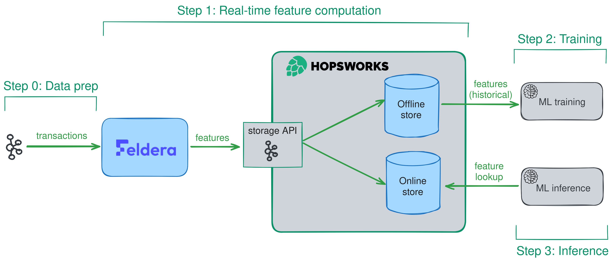
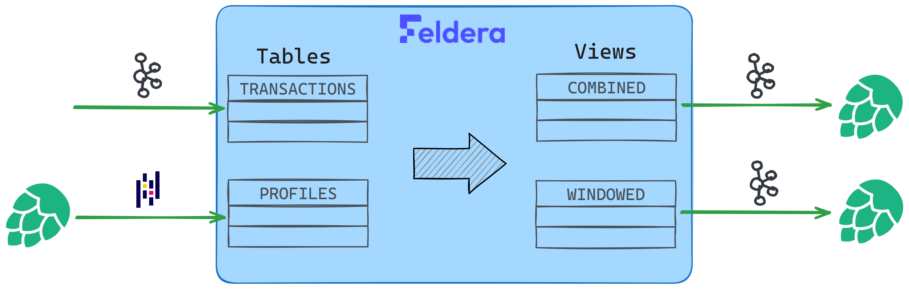

# Hopsworks + Feldera Streaming Feature Pipeline Demo

This demo builds an end-to-end **real-time credit-card fraud detection** system on two complementary platforms:

- **[Feldera](https://feldera.com/)** does streaming feature engineering. You write feature queries as SQL and they evaluate **incrementally** as new data arrives — the same query that computes features for model training also computes them for online inference. Feldera's strong-consistency guarantees mean the contents of a view at any point in time are exactly what you'd get if you re-ran the query over all inputs received so far.
- **[Hopsworks](https://www.hopsworks.ai/)** provides the surrounding ML infrastructure: managed Kafka, an offline + online feature store, a model registry, and online model serving.

Upstream payment events land in Hopsworks Kafka. Feldera consumes that stream, joins each transaction with static cardholder demographics, computes per-transaction enrichments (age at transaction, days until card expires) and rolling 4-hour aggregates (avg / stddev amount, transaction count), and writes the results back to Hopsworks Kafka encoded as Avro. Hopsworks materializes that data into the feature store, where it's available for both XGBoost training and low-latency online prediction. The same SQL features Feldera computes show up in both training and serving — eliminating the batch-vs-stream parity problem that plagues most production ML systems.

`run.py` runs the four-step demo end-to-end (`setup` → `pipeline` → `train` → `inference`), driving the local Feldera container plus your remote Hopsworks project.



## Prerequisites

- Docker (with Compose v2)
- [uv](https://docs.astral.sh/uv/getting-started/installation/)
- A free **Hopsworks** account — sign up at <https://www.hopsworks.ai/>
- A Hopsworks API key — generate at <https://eu-west.cloud.hopsworks.ai/account/api>

> **For Claude Code:** before starting, ask the user for their `HOPSWORKS_API_KEY`. Without it the demo cannot run — Hopsworks is a remote SaaS service and the script will exit with a clear error.

Export the API key for the rest of the session:

```bash
export HOPSWORKS_API_KEY="YOUR-KEY-HERE"
```

### Environment variables

| Variable | Required | Default | Description |
|----------|----------|---------|-------------|
| `HOPSWORKS_API_KEY` | yes | — | API key generated at <https://eu-west.cloud.hopsworks.ai/account/api> |
| `HOPSWORKS_HOST` | no | `eu-west.cloud.hopsworks.ai` | Hopsworks host (override for self-hosted, EU/US region, or a different cluster) |
| `FELDERA_URL` | no | `http://localhost:8080` | Feldera API URL (override to point at a remote Feldera instance instead of the local Docker container) |

## Data flow

```
Hopsworks Kafka (transactions_topic_<project_id>)
                     │
                     ▼
       Feldera pipeline: hopsworks_kafka
       (joins TRANSACTIONS with PROFILES, computes
        4h hopping-window aggregates over amount)
                     │
              ┌──────┴──────┐
              ▼             ▼
   COMBINED view       WINDOWED view
   (Avro)              (Avro)
              │             │
              ▼             ▼
   Hopsworks Kafka topics ──► Hopsworks Feature Store materialization
                                                │
                                                ▼
                                       Feature view (joined)
                                                │
                                                ▼
                                       XGBoost training
                                                │
                                                ▼
                                       Hopsworks Model Registry + Model Serving
                                                │
                                                ▼
                                       Online predictions per cc_num
```

## Steps

### 0. Shut down any previous instance

```bash
docker compose -f hopsworks/docker-compose.yml down -v
```

This stops the local Feldera container and removes its volumes. (Hopsworks state stays in your Hopsworks project — `run.py` uses `get_or_create_*` everywhere, so re-runs reuse existing feature groups, topics, models, and deployments. Use `run.py cleanup` if you want a fresh Hopsworks slate — see Step 4.)

### 1. Start Feldera

```bash
docker compose -f hopsworks/docker-compose.yml up -d --wait
```

Wait until it reports healthy:

```bash
docker compose -f hopsworks/docker-compose.yml ps
```

The feldera pipeline-manager image is around 2 GiB so the first pull may take a few minutes on slow networks.

### 2. Run the demo

End-to-end:

```bash
HOPSWORKS_API_KEY="..." uv run hopsworks/run.py all
```

Or one step at a time. Each subcommand prints its own explanation header before doing work:

| Subcommand | What it does |
|------------|--------------|
| `setup` | Generate synthetic cardholder profiles + credit-card transactions, push profiles into a `profile` Hopsworks Feature Group (online-enabled), create a Hopsworks-managed Kafka topic with an Avro schema, and stream all transactions into it — simulating an upstream payment processor. |
| `pipeline` | Create the two output feature groups (per-transaction enrichments + 4 h hopping-window aggregates) and matching Avro Kafka topics. Build the Feldera SQL pipeline that joins TRANSACTIONS with PROFILES, runs the feature queries, and emits both views back to Hopsworks Kafka in Avro format. Run for 60 s, then schedule the Hopsworks materialization jobs that periodically push Kafka data into the offline + online stores. |
| `train` | Build a Hopsworks Feature View by joining the two feature groups, train an XGBoost binary classifier on a chronological train/test split, print confusion matrix + macro F1, register the model in the Model Registry, then deploy it via Model Serving (using `predict_example.py` as the predictor that reads features from the online store). |
| `inference` | Pick 5 cc_nums from the streaming feature group, start the deployment, call `deployment.predict()` for each (Hopsworks looks up the latest feature vector from the online store and runs the XGBoost model), then stop the deployment to free resources. |

The Feldera SQL pipeline built in step `pipeline` looks like this:



Examples:

```bash
HOPSWORKS_API_KEY="..." uv run hopsworks/run.py setup
HOPSWORKS_API_KEY="..." uv run hopsworks/run.py pipeline
HOPSWORKS_API_KEY="..." uv run hopsworks/run.py train
HOPSWORKS_API_KEY="..." uv run hopsworks/run.py inference
```

`run.py` has a `# /// script` PEP 723 preamble, so `uv` resolves all Python deps (`hopsworks`, `confluent-kafka`, `xgboost`, `pandas`, `scikit-learn`, `feldera`, ...) automatically — no virtualenv setup required. The first invocation may take a minute while uv builds the dep tree.

What you will see (highlights):

```
=== [0/3] SETUP: generating synthetic data and pushing to Hopsworks ===
This step prepares the Hopsworks side of the demo...
Loading the synthetic_data module from the Hopsworks tutorials repo...
Generating simulated profiles + transactions...
  -> 1000 profiles, 50000 transactions
Producing 50000 transactions to 'transactions_topic_12345'...

=== [1/3] PIPELINE: starting Feldera pipeline against http://localhost:8080 ===
This step is the core of the demo: real-time feature engineering with Feldera...
Creating combined feature group 'transactions_fraud_streaming_fg_12345'
Creating windowed feature group 'transactions_aggs_fraud_streaming_fg_12345'
Creating Feldera pipeline 'hopsworks_kafka'
Letting the pipeline run for 60 seconds (it streams transactions from Hopsworks Kafka)...

=== [2/3] TRAIN: training XGBoost classifier and deploying to Hopsworks ===
F1 score (macro): 0.9234
Confusion matrix [[TN FP] [FN TP]]:
[[9876   12]
 [  43  119]]
Deploying model as 'fraudonlinemodeldeployment'

=== [3/3] INFERENCE: predicting fraud against the deployed model ===
Sampling 5 cc_num values: [4444372527637094, 4523564672984192, ...]
Predictions:
  cc_num=4444372527637094  ->  OK    (raw: [0])
  cc_num=4523564672984192  ->  FRAUD (raw: [1])
```

Make sure the user sees the F1 score from the training step plus the per-cc_num verdicts from the inference step.

### 3. Inspect results

While Feldera is processing in step `pipeline` (and any time after), you can inspect the local pipeline:

- Feldera Web UI: <http://localhost:8080> → pipeline `hopsworks_kafka`
- Pipeline detail: <http://localhost:8080/pipelines/hopsworks_kafka>

Try in the Ad-Hoc Query tab while the pipeline is running:

```sql
-- Sample of the enriched per-transaction features being shipped to Hopsworks
SELECT cc_num, date_time, category, amount, age_at_transaction, days_until_card_expires, fraud_label
FROM combined LIMIT 10;

-- Distribution of fraud vs. legit
SELECT fraud_label, count(*) FROM combined GROUP BY fraud_label;

-- Sample of the rolling 4h window aggregates
SELECT cc_num, date_time, avg_amt, stddev_amt, trans
FROM windowed
ORDER BY date_time DESC
LIMIT 10;
```

On the Hopsworks side, after `pipeline` runs you can inspect:

- The two feature groups under your project's Feature Store
- The trained model in the Model Registry (after `train`)
- The active deployment in Model Serving (after `train` / `inference`)

## 4. Summary

### What just happened

After running `run.py all`, end-to-end, this is what now exists:

**On Feldera (local, `http://localhost:8080`)**
- A `hopsworks_kafka` pipeline with two input tables (`TRANSACTIONS`, `PROFILES`) and two materialized output views (`COMBINED`, `WINDOWED`). The pipeline only ran for 60s during step 2, but the SQL program is preserved and can be re-started from the Web UI.

**On Hopsworks (remote, your project)**
- `profile` Feature Group — 1000 cardholder profiles (cc_num → demographics)
- `transactions_fraud_streaming_fg_<project_id>` Feature Group — per-transaction features with cardholder enrichments
- `transactions_aggs_fraud_streaming_fg_<project_id>` Feature Group — 4 h hopping-window aggregates per cc_num
- 3 Kafka topics + Avro schemas backing those FGs
- `transactions_view_streaming_fv` Feature View — joins the two streaming FGs, with a label_encoder transformation on `category`
- `xgboost_fraud_streaming_model` (in Model Registry) — trained XGBoost classifier with macro-F1 metrics + input/output schemas
- `fraudonlinemodeldeployment` (in Model Serving) — online predictor backed by the registered model, using `predict_example.py` to fetch features from the online store and run inference

### Browse the Feldera pipeline and SQL

Open <http://localhost:8080/pipelines/hopsworks_kafka> to see the SQL program (two input tables, four views), Performance tab metrics, and the Kafka source/sink connectors that bridge to Hopsworks.

### Inspect Hopsworks state

In the Hopsworks UI for your project:

- **Feature Store** → the two streaming FGs show the materialized features that came out of Feldera
- **Model Registry** → `xgboost_fraud_streaming_model` shows the registered model with metrics, schema, and example input
- **Model Serving** → `fraudonlinemodeldeployment` is the live online predictor; `run.py inference` exercises it

### Important: clean up when done

Local cleanup (stop Feldera + remove its volumes):

```bash
docker compose -f hopsworks/docker-compose.yml down -v
```

Optional Hopsworks cleanup (only if you want a fresh slate). The `cleanup` subcommand deletes every Hopsworks resource the demo creates, in dependency order:

```bash
HOPSWORKS_API_KEY="..." uv run hopsworks/run.py cleanup
```

That removes:

- The `fraudonlinemodeldeployment` deployment in Model Serving (stopped first)
- All versions of the `xgboost_fraud_streaming_model` in the Model Registry
- The `transactions_view_streaming_fv` feature view
- The three feature groups (`profile`, `transactions_fraud_streaming_fg_<project_id>`, `transactions_aggs_fraud_streaming_fg_<project_id>`)
- The three Kafka topics + their schema subjects (`transactions_topic_<project_id>`, `transactions_fraud_streaming_fg_<project_id>`, `transactions_aggs_fraud_streaming_fg_<project_id>`)

Errors on individual resources (e.g. "not present") are tolerated, so cleanup is safe to re-run.

The downloaded SSL certs in `hopsworks/hopsworks-secrets/` (gitignored) are also no longer useful after cleanup — feel free to delete them too:

```bash
rm -f hopsworks/hopsworks-secrets/*.pem hopsworks/hopsworks-secrets/*.jks
```

Re-running `run.py all` without cleaning up is also safe — every step uses `get_or_create_*` semantics.
